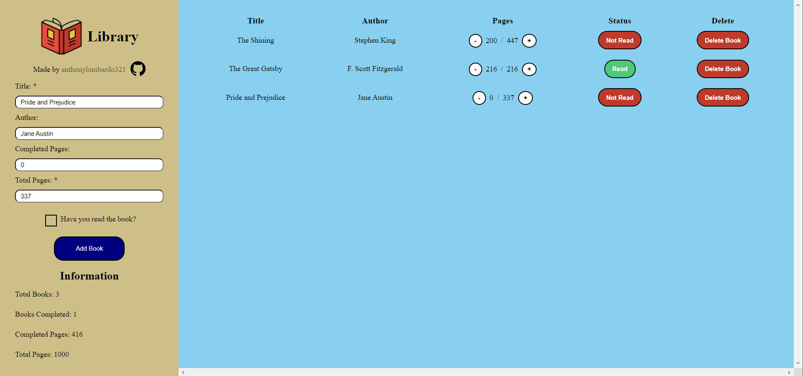

# Library
## Link: https://anthonylombardo321.github.io/Library/

    

## Features
* Book Form for Adding Books (Will add editing in the future)
* Information Section: Total Books, Books Completed, Completed Pages, Total Pages
* Increase/Decrease Pages You've Read For a Certain Book
* Toggle Read Status
* Delete Books from Library

## What I Learned:
* How to use objects to store book information
* How to use a table to display information from objects
* How to add event listeners to table buttons
* Reinforcing I learned so far for HTML, CSS (Flex), and JavaScript (Event Listeners)